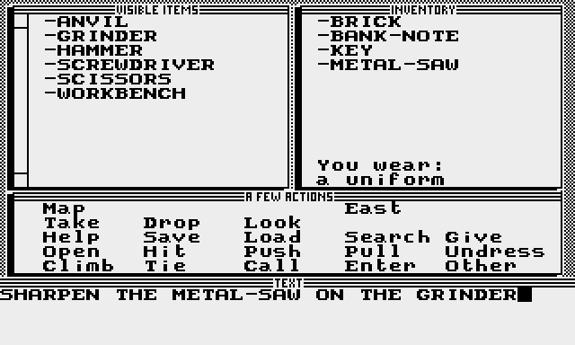
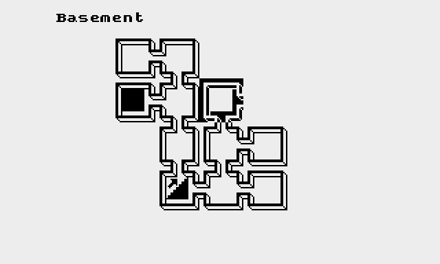

# F.R.E.E. user's manual

Bertrand Le Roy, Fabien and Anne Royer, April 7, 1995

## How to load F.R.E.E.?

Just insert the first disk, side 1 into your drive, and turn on the computer while holding
the OPTION key depressed. After a few seconds, you will see the title screen of F.R.E.E.

Press `START` or any other key. Then you are presented with the story of the game. You
may scroll this text with a joystick or with the `OPTION` and `SELECT` keys. Once
you've read the text, you can go on and load the game itself by pressing `START`.

## How to play?

There are two distinct screens in F.R.E.E. There is the graphic screen, representing the
place where you are, and the text screen, where the game itself is. You can switch from
one screen to the other by pressing the space bar. When on the text screen, you can move
the cursor with the joystick or the keyboard arrows. You can validate your choices by
pressing the fire button or `Return`. The text screen is separated into four windows.

### The visible items

The top left window contains the list of the objects visible in the room. If more objects
than can fit in the window are present, tiny arrows appear on the left of the window.
When you choose an object in this window, you can make the list scroll with the joystick
or the arrows.

### The inventory

The top right window contains the list of the objects you are carrying. You can't carry
more than ten objects. On the bottom of this window, you can read how you are dressed.

### The action window

The middle window contains some of the most frequently used verbs and actions. Among
these, there are the bearings (`North`, `South`, `East`, `West`, `Up`, `Down`).
But they are displayed only when available. If you see none, then you can't exit the room, at
least not by walking out. If you want to do something that isn't among these actions,
press `Esc` then type your order. For example, `SHARPEN THE METAL-SAW WITH THE GRINDER`.
Then press Return.

### Map

The game automatically draws a map of the places you've already been. You can
also move on this map. To do this, move the cursor and validate. You will travel much
faster this way since you don't have to load the pictures of all the places on your way.

### Take, Drop

To use this, just choose the object you want to take or drop, then validate. Some objects
can't be taken. For example, you can't take a bulldozer and put it in your pocket.
If you're already carrying ten objects, you can't take more. Drop something you don't need
anymore before taking a new object.

### Look

You may look at any object that is in the visible items or the inventory. When asked,
you can choose between these two options by going to the left or to the right with the
joystick or the arrow keys.

### Save, Load

You may save and load games in progress. You have two possibilities. Either you save
into the memory of the computer, or on a disk. If you save into memory, the operation
will be instantaneous aud you won't have to switch disks. But if you turn the computer
off, this game will be lost. To save on a disk, tell the program if you want to format
a disk (use cautiously) and in which of the ten areas of the disk you want to save.
Your save disk must be used only for this purpose. For example, you may use the second side
of the third disk of F.R.E.E., as it is not used by the program. A save or load operation
can be cancelled by pressing `Esc` when the computer is waiting for an answer from you.

### Help
In every room where you may need it, you may ask for a tip. But if I were you, I would
use this only when you are really stuck. Otherwise, it may spoil the game and make it
too easy. The less you use Help, the longer the lifetime of F.R.E.E.

### Room
In each room, you can get a description of the place by typing `ROOM`. These descriptions
often contain some additional clues.

## From now on, you're on your own

Well, quite. If you need some support, you can always [lookup the walkthrough](walkthrough.md).
